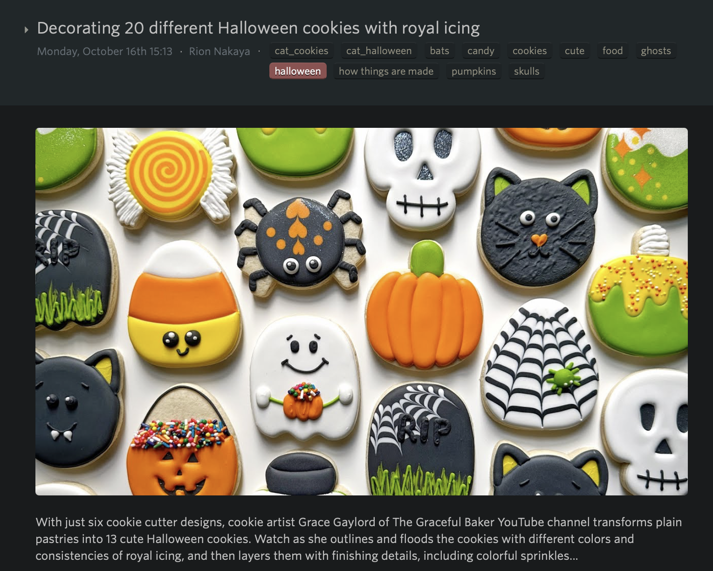
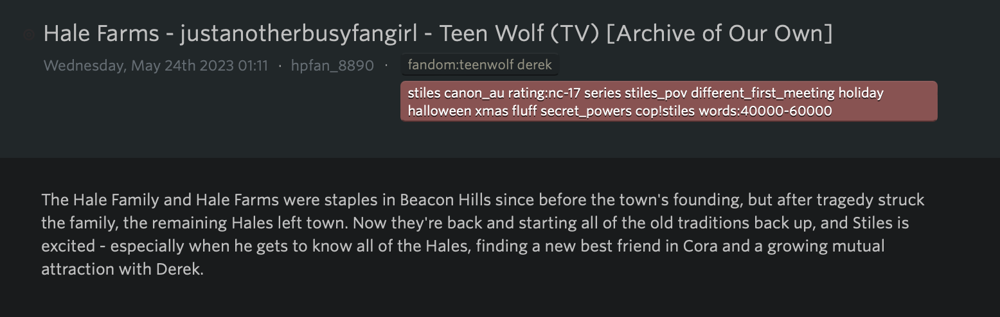

# Pinboard for NewsBlur

A proxy for pinboard.in feeds that fixes the keywords to be displayed correctly in NewsBlur, periodically 
published to GitHub Pages, so that I can subscribe to this feed instead of the original one. 

## Why?

[pinboard.in][pinboard] is the bookmarking site that I use to store links I find interesting,
you can find mine at [pinboard.in/u:jeromegamez][mine].

[NewsBlur][newsblur] is my RSS-Reader of choice, mostly because of its Site Intelligence Trainer,
with which I can hide posts with certain keywords in their title and/or tags.

I also use it for its [Popular Bookmarks][popular] - I subscribed to its [RSS feed][rss] in
[NewsBlur][newsblur] and always have something interesting to read when my other feeds are
empty.

For example, if I weren't interested in Halloween, I would hide feed items with the Halloween
keyword like this:

In pinboard, when a story has multiple keywords, they aren't displayed correctly. Instead of them
being separated, all keywords are shown as if they were one single keyword.

]

## How?

This is my attempt to, for once, make something that isn't super-polished - in fact this is super-dirty.
Okay, I lied: I first _did_ try to make this a polished project, but when I realized that working with 
RDF feeds is a royal pain, I decided to make it easy for myself: Regular Expressions.

[You shouldn't parse XML or HTML with Regular Expressions](stack-overflow).

## Feeds

* Pinboard Popular
  * Source: https://feeds.pinboard.in/rss/popular/
  * NewsBlured: https://jeromegamez.github.io/pinboard-for-newsblur/popular.xml

## License

This project is published under the [ISC License](LICENSE).

[pinboard]: https://pinboard.in
[mine]: https://pinboard.in/u:jeromegamez
[popular]: https://pinboard.in/popular/
[rss]: http://feeds.pinboard.in/rss/popular/
[newsblur]: https://newsblur.com
[tksst-halloween]: https://thekidshouldseethis.com/post/decorating-20-different-halloween-cookies-with-royal-icing
[stack-overflow]: https://stackoverflow.com/a/1732454/284325
